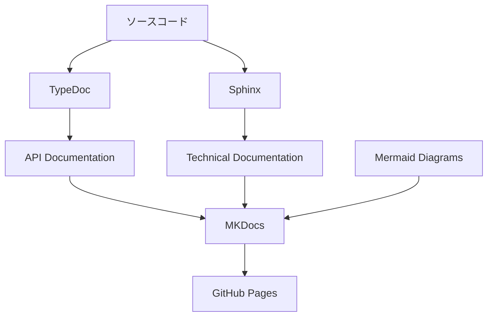
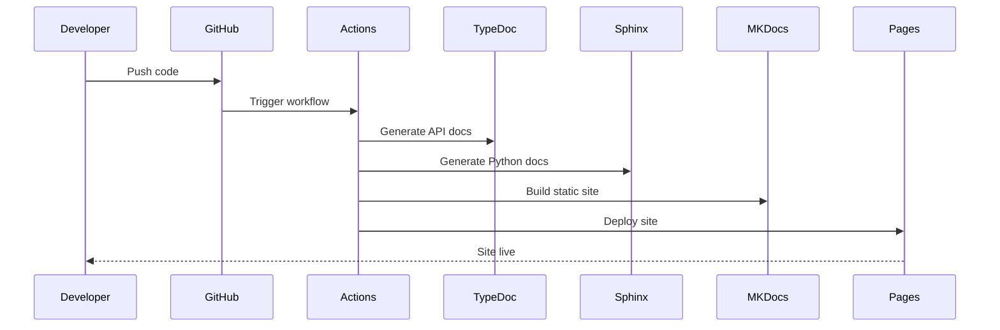

# MKDocsドキュメントホスティング設計方針

## 概要

GitHub Pages上でMKDocsを使用してドキュメントサイトをホスティングし、TypeDoc、Sphinx、Mermaidシーケンス図を統合したドキュメントシステムを構築する。

## アーキテクチャ



## 技術スタック

### コアツール
- **MKDocs**: 静的サイトジェネレーター
- **Material for MKDocs**: モダンなテーマとUI
- **GitHub Actions**: CI/CDパイプライン
- **GitHub Pages**: ホスティングプラットフォーム

### ドキュメント生成
- **TypeDoc**: TypeScript/JavaScriptのAPI文書自動生成
- **Sphinx**: Pythonプロジェクトの技術文書生成
- **Mermaid**: シーケンス図、フローチャート、その他の図表

## ディレクトリ構成

```
project_docs/
├── docs/                    # MKDocsドキュメントソース
│   ├── index.md            # トップページ
│   ├── api/                # API文書
│   │   ├── typescript/     # TypeDoc生成文書
│   │   └── python/         # Sphinx生成文書
│   ├── diagrams/           # Mermaid図表
│   │   ├── sequence/       # シーケンス図
│   │   ├── flowchart/      # フローチャート
│   │   └── architecture/   # アーキテクチャ図
│   ├── guides/             # 技術ガイド
│   ├── tutorials/          # チュートリアル
│   └── reference/          # リファレンス
├── mkdocs.yml              # MKDocs設定ファイル
├── requirements.txt        # Python依存関係
├── package.json            # Node.js依存関係
├── .github/
│   └── workflows/
│       └── deploy.yml      # GitHub Actions設定
├── scripts/                # ビルドスクリプト
│   ├── build-typedoc.js    # TypeDoc生成スクリプト
│   └── build-sphinx.py     # Sphinx生成スクリプト
└── src/                    # サンプルソースコード
    ├── typescript/
    └── python/
```

## 主要機能

### 1. TypeDoc統合
- TypeScriptプロジェクトからAPI文書を自動生成
- 型情報、インターファイス、クラスの詳細文書化
- MKDocsとの統合により統一されたナビゲーション

### 2. Sphinx統合
- PythonプロジェクトのdocstringからAPI文書生成
- reStructuredText形式からMarkdownへの変換
- コードサンプルとドキュメントの同期

### 3. Mermaid図表
- シーケンス図によるプロセスフロー可視化
- フローチャートによるアーキテクチャ表現
- インタラクティブな図表表示

### 4. GitHub Pages自動デプロイ
- プッシュ時の自動ビルドとデプロイ
- ブランチベースの環境管理
- カスタムドメイン対応

## 設定ファイル仕様

### MKDocs設定 (mkdocs.yml)
```yaml
site_name: Project Documentation
site_description: Comprehensive project documentation
repo_url: https://github.com/username/project_docs
theme:
  name: material
  features:
    - navigation.tabs
    - navigation.sections
    - toc.integrate
    - search.suggest
    - search.highlight
  palette:
    - scheme: default
      primary: blue
      accent: blue

plugins:
  - search
  - mermaid2
  - typedoc
  - mkdocstrings:
      handlers:
        python:
          setup_commands:
            - import sys
            - sys.path.append('src/python')

markdown_extensions:
  - pymdownx.mermaid
  - pymdownx.highlight
  - pymdownx.superfences
  - admonition
  - codehilite

nav:
  - Home: index.md
  - API Reference:
    - TypeScript: api/typescript/
    - Python: api/python/
  - Diagrams:
    - Sequence Diagrams: diagrams/sequence/
    - Architecture: diagrams/architecture/
  - Guides: guides/
  - Tutorials: tutorials/
```

## CI/CDパイプライン

### GitHub Actions ワークフロー
1. **ソースコード変更検知**
2. **TypeDoc実行** - TypeScriptファイルからAPI文書生成
3. **Sphinx実行** - Pythonプロジェクトから文書生成
4. **MKDocs Build** - 統合ドキュメントサイト生成
5. **GitHub Pages Deploy** - 生成サイトのデプロイ

### ビルドプロセス


## セキュリティとメンテナンス

### セキュリティ
- 依存関係の定期的なアップデート
- Dependabot による脆弱性監視
- Private repository での機密情報管理

### メンテナンス
- 月次の依存関係更新
- ドキュメントの定期レビュー
- デッドリンクチェック自動化
- パフォーマンス監視

## 拡張性

### プラグイン拡張
- カスタムMKDocsプラグイン開発
- 追加言語サポート（Java、C#等）
- 外部APIドキュメント統合

### 国際化
- 多言語サポート（i18n）
- 言語切り替え機能
- 翻訳ワークフロー

## パフォーマンス最適化

### ビルド最適化
- 増分ビルドサポート
- キャッシュ活用
- 並列処理

### サイトパフォーマンス
- 画像最適化
- CSS/JS最小化
- CDN活用

## 監視とアナリティクス

### 監視項目
- サイト稼働時間
- ビルド成功率
- ページ読み込み速度

### アナリティクス
- Google Analytics統合
- ユーザー行動分析
- ドキュメント利用統計

## 導入フェーズ

### Phase 1: 基盤構築
- MKDocsセットアップ
- 基本テーマ適用
- GitHub Actions設定

### Phase 2: 自動生成統合
- TypeDoc統合
- Sphinx統合
- 基本的なMermaid図

### Phase 3: 高度機能
- カスタムプラグイン
- 高度な図表
- 検索機能強化

### Phase 4: 運用最適化
- パフォーマンス調整
- 監視システム
- ユーザーフィードバック統合
