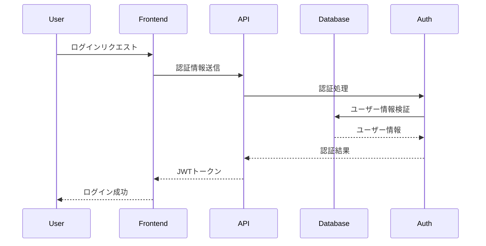
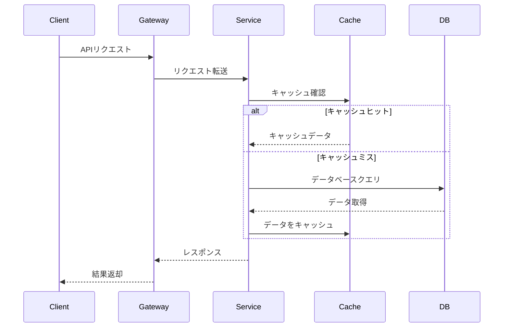
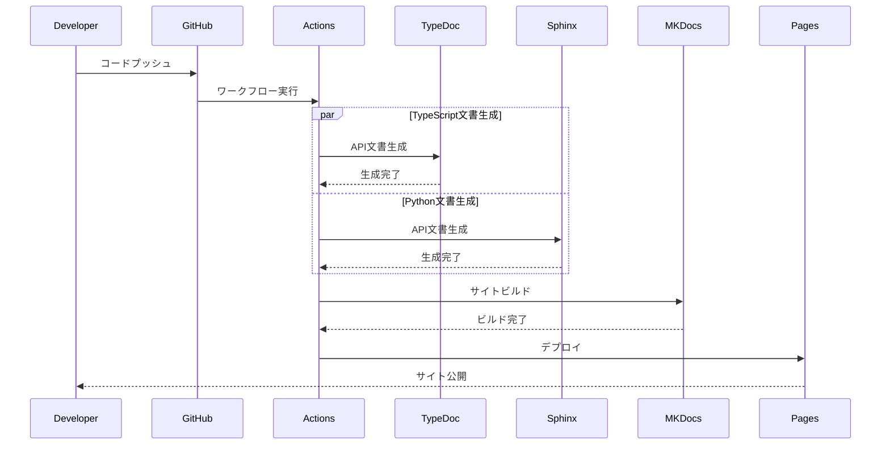
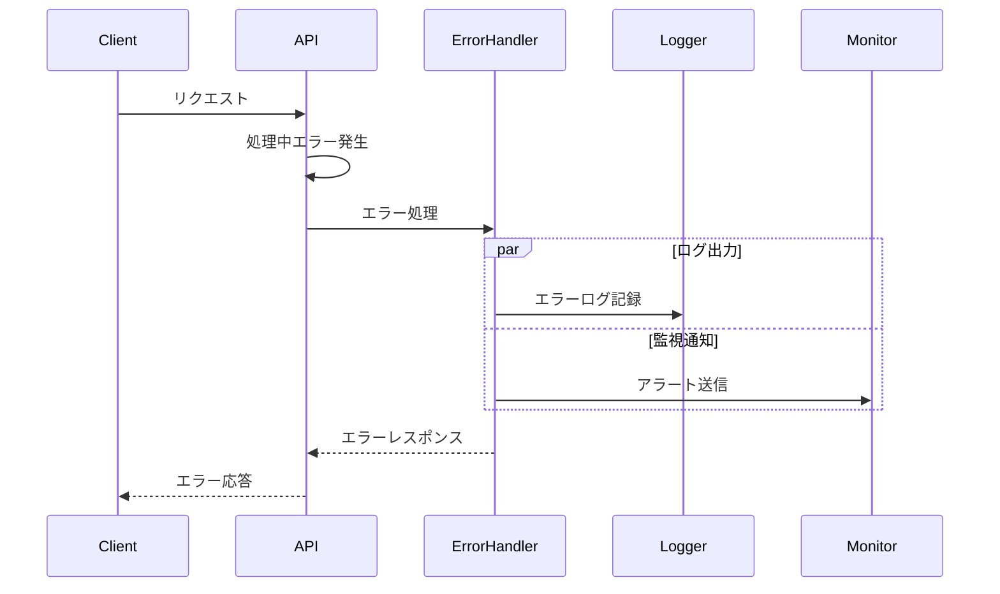
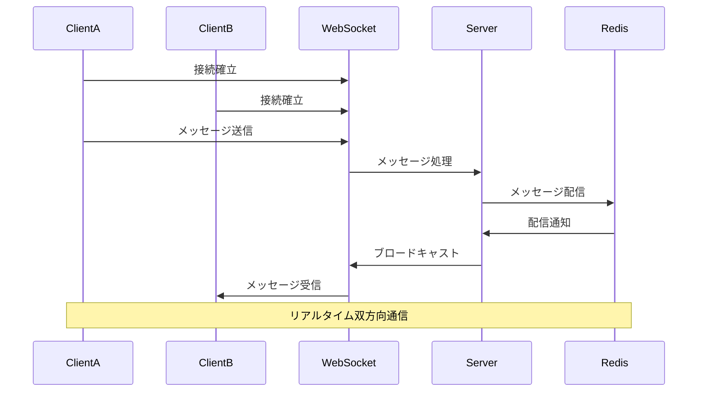
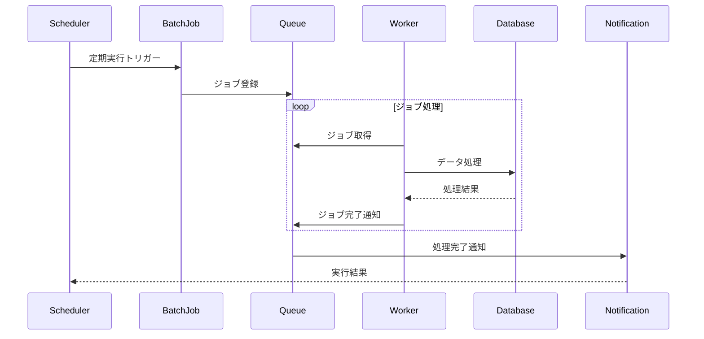

# アーキテクチャシーケンス図

システムの主要なフローをシーケンス図で表現します。

## ユーザー認証フロー

```mermaid
sequenceDiagram
    participant User
    participant Frontend
    participant API
    participant Database
    participant Auth

    User->>Frontend: ログインリクエスト
    Frontend->>API: 認証情報送信
    API->>Auth: 認証処理
    Auth->>Database: ユーザー情報検証
    Database-->>Auth: ユーザー情報
    Auth-->>API: 認証結果
    API-->>Frontend: JWTトークン
    Frontend-->>User: ログイン成功
```

## データ処理フロー

```mermaid
sequenceDiagram
    participant Client
    participant Gateway
    participant Service
    participant Cache
    participant DB

    Client->>Gateway: APIリクエスト
    Gateway->>Service: リクエスト転送
    Service->>Cache: キャッシュ確認
    
    alt キャッシュヒット
        Cache-->>Service: キャッシュデータ
    else キャッシュミス
        Service->>DB: データベースクエリ
        DB-->>Service: データ取得
        Service->>Cache: データをキャッシュ
    end
    
    Service-->>Gateway: レスポンス
    Gateway-->>Client: 結果返却
```

## ドキュメント生成フロー

```mermaid
sequenceDiagram
    participant Developer
    participant GitHub
    participant Actions
    participant TypeDoc
    participant Sphinx
    participant MKDocs
    participant Pages

    Developer->>GitHub: コードプッシュ
    GitHub->>Actions: ワークフロー実行
    
    par TypeScript文書生成
        Actions->>TypeDoc: API文書生成
        TypeDoc-->>Actions: 生成完了
    and Python文書生成
        Actions->>Sphinx: API文書生成
        Sphinx-->>Actions: 生成完了
    end
    
    Actions->>MKDocs: サイトビルド
    MKDocs-->>Actions: ビルド完了
    Actions->>Pages: デプロイ
    Pages-->>Developer: サイト公開
```

## エラーハンドリングフロー

```mermaid
sequenceDiagram
    participant Client
    participant API
    participant ErrorHandler
    participant Logger
    participant Monitor

    Client->>API: リクエスト
    API->>API: 処理中エラー発生
    API->>ErrorHandler: エラー処理
    
    par ログ出力
        ErrorHandler->>Logger: エラーログ記録
    and 監視通知
        ErrorHandler->>Monitor: アラート送信
    end
    
    ErrorHandler-->>API: エラーレスポンス
    API-->>Client: エラー応答
```

## リアルタイム通信フロー

```mermaid
sequenceDiagram
    participant ClientA
    participant ClientB
    participant WebSocket
    participant Server
    participant Redis

    ClientA->>WebSocket: 接続確立
    ClientB->>WebSocket: 接続確立
    
    ClientA->>WebSocket: メッセージ送信
    WebSocket->>Server: メッセージ処理
    Server->>Redis: メッセージ配信
    
    Redis->>Server: 配信通知
    Server->>WebSocket: ブロードキャスト
    WebSocket->>ClientB: メッセージ受信
    
    Note over ClientA, Redis: リアルタイム双方向通信
```

## バッチ処理フロー

```mermaid
sequenceDiagram
    participant Scheduler
    participant BatchJob
    participant Queue
    participant Worker
    participant Database
    participant Notification

    Scheduler->>BatchJob: 定期実行トリガー
    BatchJob->>Queue: ジョブ登録
    
    loop ジョブ処理
        Worker->>Queue: ジョブ取得
        Worker->>Database: データ処理
        Database-->>Worker: 処理結果
        Worker->>Queue: ジョブ完了通知
    end
    
    Queue->>Notification: 処理完了通知
    Notification-->>Scheduler: 実行結果
```
