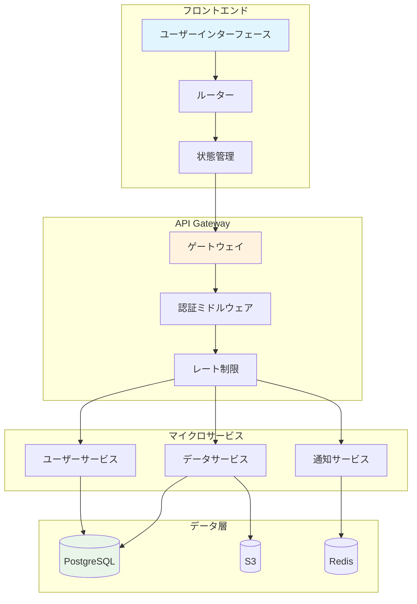
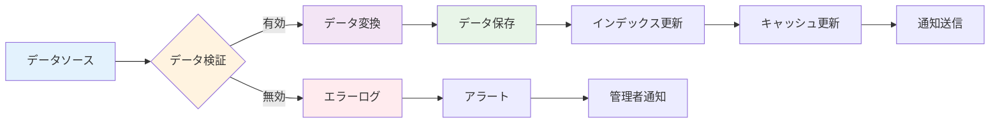
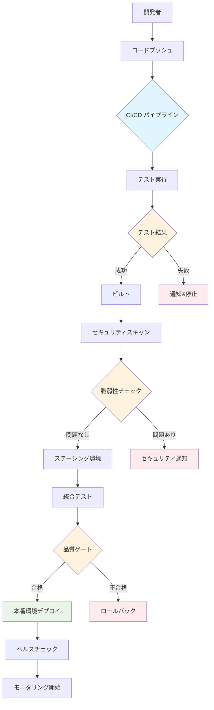
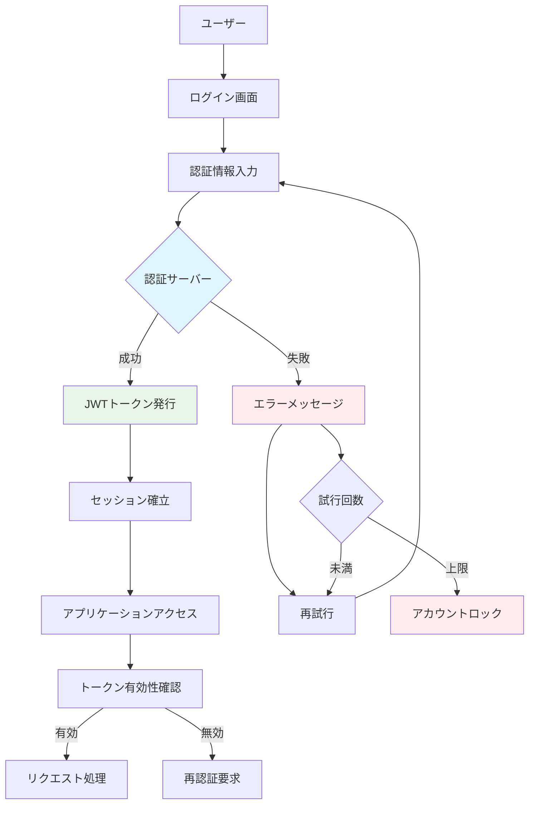
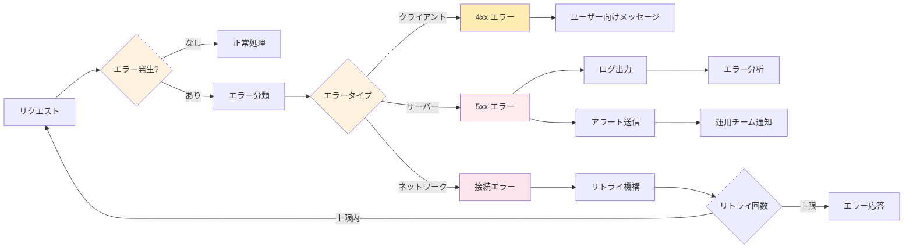
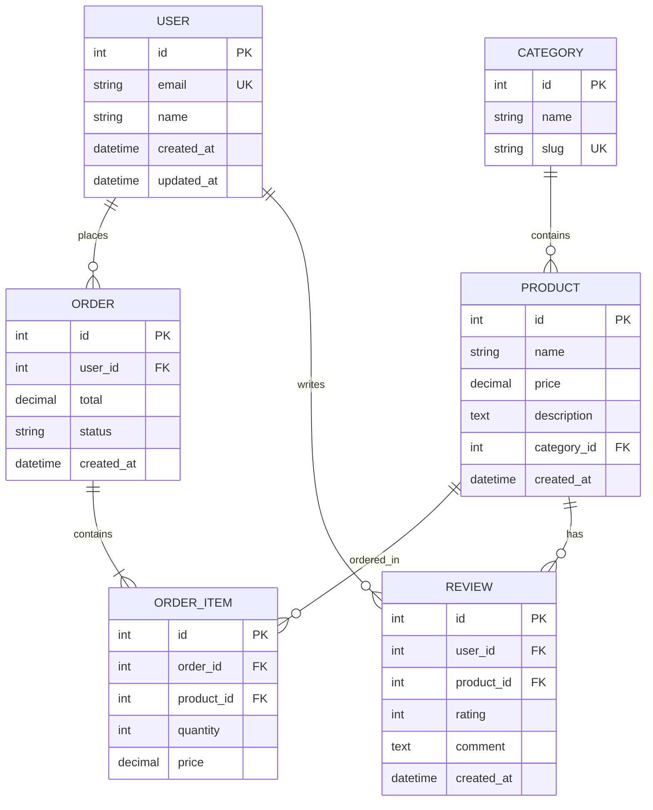
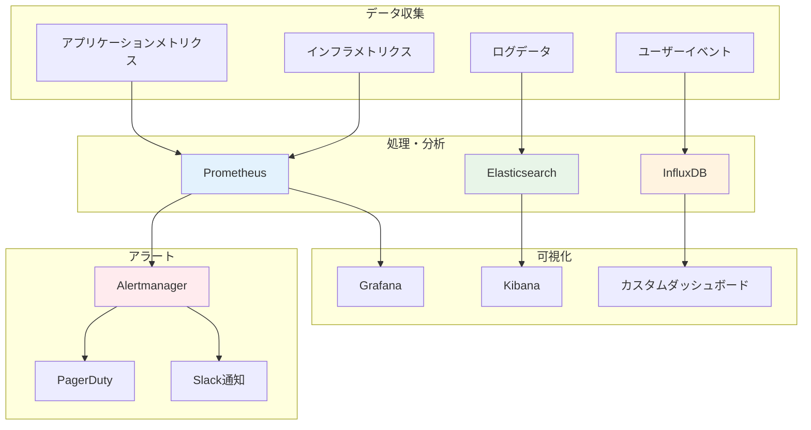
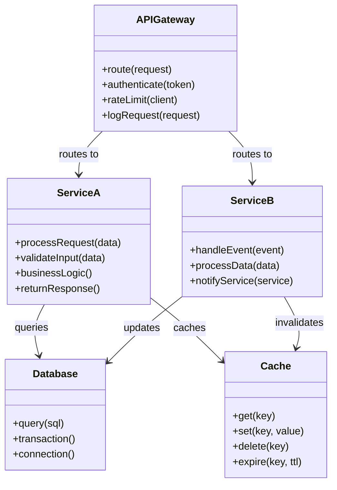

# フローチャートと図表

システムの構造とフローを視覚的に表現するための各種図表です。

## システムアーキテクチャ

## データフロー図

## デプロイメントフロー

## ユーザー認証フロー

## エラーハンドリングフロー

## データベース設計

## モニタリングダッシュボード構成

## API設計パターン

!!! tip "図表の活用"
    これらの図表は以下の用途で活用できます：
    
    - **システム理解**: 全体像の把握
    - **設計レビュー**: アーキテクチャの検証
    - **ドキュメント**: 技術仕様書への組み込み
    - **教育**: 新メンバーへの説明資料

!!! note "図表の更新"
    システムの変更に合わせて図表も更新することで、
    常に最新の状態を保つことができます。
