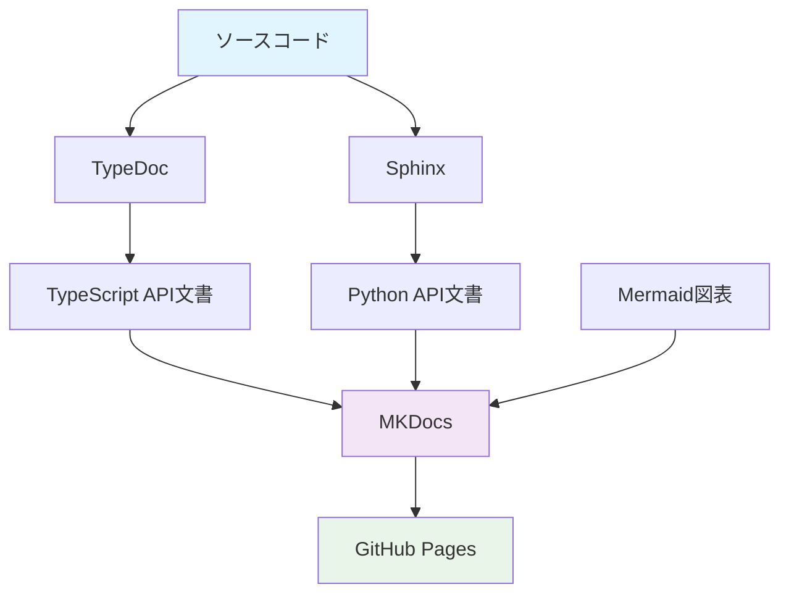

# Project Documentation

プロジェクトの包括的なドキュメントサイトへようこそ。このサイトでは、API リファレンス、アーキテクチャ図、開発ガイドなどを提供しています。

## 🚀 特徴

- **自動生成API文書**: TypeDocとSphinxによる最新のAPI文書
- **インタラクティブ図表**: Mermaidによるシーケンス図とフローチャート
- **統合検索**: 全コンテンツを横断した高速検索
- **レスポンシブデザイン**: モバイル対応の美しいUI
- **自動デプロイ**: GitHub Actionsによる継続的インテグレーション

## 📚 ドキュメント構成

### [アーキテクチャ](architecture/overview.md)
システムの全体設計とコンポーネント構成について説明します。

- [システム設計](architecture/system-design.md)
- [シーケンス図](architecture/sequences.md)

### [API リファレンス](api/typescript/)
自動生成されたAPIドキュメント

- [TypeScript API](api/typescript/) - TypeDocで生成
- [Python API](api/python/) - Sphinxで生成

### [開発ガイド](guides/development-setup.md)
開発環境のセットアップと開発フロー

- [開発環境構築](guides/development-setup.md)
- [デプロイメントガイド](guides/deployment.md)
- [ベストプラクティス](guides/best-practices.md)

### [チュートリアル](tutorials/quickstart.md)
段階的な学習コンテンツ

- [クイックスタート](tutorials/quickstart.md)
- [応用的な使い方](tutorials/advanced.md)

## 🎯 クイックスタート

```bash
# リポジトリをクローン
git clone https://github.com/username/project_docs.git
cd project_docs

# 依存関係をインストール
pip install -r requirements.txt
npm install

# ドキュメントを生成
npm run docs:build

# ローカルサーバーで確認
npm run docs:serve
```

## 📊 システム概要



## 🛠️ 技術スタック

| 技術 | 用途 | バージョン |
|------|------|------------|
| MKDocs | 静的サイト生成 | 1.5+ |
| Material for MKDocs | テーマ・UI | 9.0+ |
| TypeDoc | TypeScript API文書 | 0.25+ |
| Sphinx | Python API文書 | 7.0+ |
| Mermaid | 図表生成 | 10.0+ |
| GitHub Actions | CI/CD | - |

## 📈 更新情報

!!! info "最新情報"
    このドキュメントは自動的に更新されます。最新のコード変更が反映されていることを確認してください。

